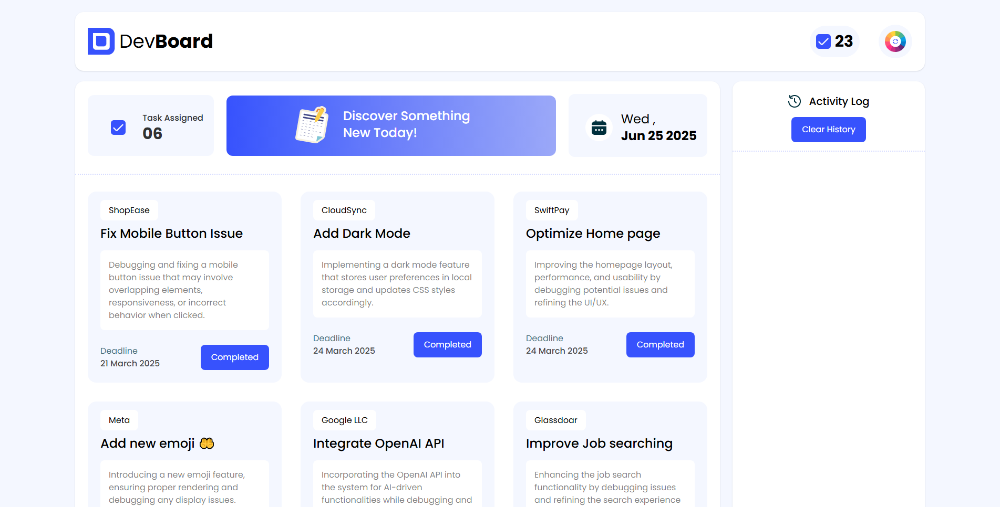

# 🧑‍💻 DevBoard – JavaScript Practice Project

**DevBoard** is a practice project built as **Assignment 5**, designed to demonstrate various JavaScript concepts through a functional and interactive web interface. It includes task management, DOM manipulation, button state control, a blog page, and a random background color generator.

## ✨ Features

- ✅ **Task Management:**
  - Click "Job Done" to decrease the task number
  - Button gets disabled after action to prevent repeated clicks
  - Real-time UI updates using JavaScript

- 📝 **Blog Page:**
  - Static blog section for displaying articles/posts
  - Clean layout styled with Tailwind CSS

- 🎨 **Random Background Color Generator:**
  - One-click button changes the background to a random color
  - Useful for demonstrating dynamic styling via JS

## 🛠️ Tech Stack

- **HTML**
- **Tailwind CSS**
- **JavaScript**

## 📸 Preview

 <!-- Add an actual screenshot if available -->

## 🚀 Getting Started

To view locally:

```bash
git clone https://github.com/your-username/devboard-assignment.git
cd devboard-assignment
# Open index.html in your browser
